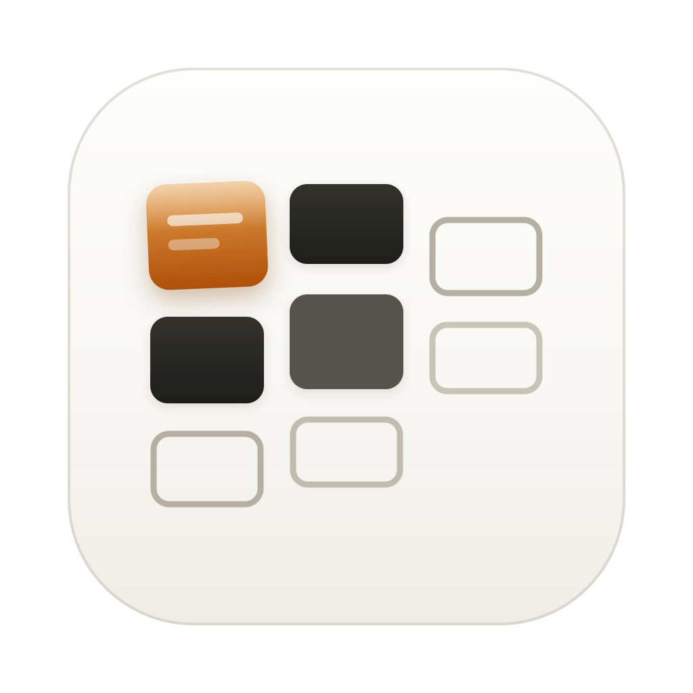

<p align="center">
  
</p>

<h1 align="center">Butler</h1>

<p align="center">
  <a href="README.md">English</a> · <a href="README.zh-CN.md">简体中文</a> · 日本語 · <a href="README.ko.md">한국어</a> · <a href="README.es.md">Español</a>
</p>

<p align="center"><b>マルチスレッド vibecoding のためのプロジェクト管理ツール。</b><br>
Claude Code と Codex を並行して走らせる ADHD 脳のために。すべての agent、スレッド、次の一手を見守る、あなたの古き良きバトラーです。</p>

<p align="center">
  <code>Claude Code</code> · <code>Codex</code> · <code>ADHD-friendly</code> · <code>menu-bar</code> · <code>multi-project</code> · <code>macOS</code>
</p>

https://github.com/user-attachments/assets/dcd7e423-e870-434b-8a9f-a94320bc962a

---

## 課題

複数の AI coding agent（Claude Code、Codex など）を並行して動かしていると、コードよりも先に文脈がこぼれます。

- **どのセッションが自分待ちか**忘れる。
- **それぞれがどこまで進んだか**忘れる。
- **どれが一番大事か**判断しづらい。
- 朝起きた時に、**どのプロジェクトから始めるべきか**分からない。

ただのリマインダーでは足りません。通知は鳴りますが、進捗、状態、優先順位までは保ってくれません。

agent 作業は配達のようなものです。待っている時間は静かですが、依頼が来た瞬間にすぐ動く必要があります。深い集中は細かく分断され、ADHD の脳には特につらくなります。

Butler は、各プロジェクトの最初の目的、現在の進捗、直近 3 件のやり取り、優先順位を近くに置きます。目的は agent credit を使い切ることではありません。credit では買い戻せない時間を守ることです。

**Butler は、並行 agent 作業のためのバトラーです。** あなたの代わりに作業するのではなく、作業を落とさないように見張ります。

## できること

| 画面 | 得られるもの |
|---|---|
| **▦ メニューバーバッジ** | `▦ 2` = 2 件があなた待ち、`▦ ·` = 実行中、`▦` = 静か。画面上部を見るだけで全体が分かります。 |
| **ポップオーバー**（▦ をクリック） | あなた待ちのカードは amber の呼吸グロー、新規カードは軽いパルス。名前、プロジェクトの最初の目的、優先度、アーカイブ、コピーをその場で操作できます。 |
| **デスクトップ mini カード** | 232px の小さなカードをデスクトップに固定。最優先の作業を視界に残しながら、壁紙の上、ウィンドウの下に置けます。ピン留めやドラッグ移動もできます。 |
| **システム通知** | agent が running から waiting に変わった瞬間、最後の出力を添えて次の一手を知らせます。ネイティブ macOS 通知、正しいアイコン、スパムなし、日次ダイジェスト付き。 |
| **フルボード** | 列間ドラッグ、Claude/Codex タブ、P0/P1/P2 優先度、プロジェクト目的、直近 3 件の recap。何のためのプロジェクトかすぐ思い出せます。 |
| **Butler Light companion** | 任意の LED companion。Butler が小さなローカル JSON を書き、Butler Light が Waiting > Running > Shelved を色に変換します。 |

### モデル：agent 版 inbox zero

- **Running / Waiting = 事実**：agent の状態です。1 時間止まっていても、あなた待ちです。
- **Shelved = あなたの判断**：手動でアーカイブした時だけ inbox から外れます。
- **Scheduled / cron セッション**：実行中だけ表示し、完了後は消えます。偽の todo にはしません。
- **P0/P1/P2**：waiting リストを並べ替え、朝の最初のカードをその日の入口にします。

## インストール

> Butler は notarize されていません。macOS が “unidentified developer” と表示する場合があります。初回だけ **右クリック → Open** で開けば、その後は通常通り起動できます。

必要なもの：macOS 13+、Xcode Command Line Tools（`xcode-select --install`）、Node（Claude session hooks 用）。

```bash
git clone https://github.com/YOUR_USER/agent-butler.git ~/dev/agent-butler
bash ~/dev/agent-butler/native/build.sh          # compile → /Applications/Butler.app → launch
```

`build.sh` は Swift app をコンパイルし、パッケージ化し、Claude session hooks をインストールします。初回通知で権限プロンプトが出たら許可してください。メニューから **Login at startup** を有効にできます。

外部依存は Claude session hooks（自動インストール）とシステムの `python3` だけです。pip、venv、Homebrew は不要です。

## 録画用：デモモード

スクリーンショット、デモ、ローンチ動画を撮る時は、メニューバーの `▦` アイコンを右クリックし、**デモモード** をオンにします。

デモモードでは固定のダミー Claude/Codex プロジェクトだけを表示し、実際のセッション、transcripts、パス、プロジェクト名、メモは読みません。カード名、目的メモ、優先度、列移動はそのまま編集できますが、変更は `~/.claude-monitor/demo-extras.json` にだけ保存されます。メニューバッジ、ポップオーバー、mini ボード、フルボード、Butler Light の状態ブリッジは、オフにするまで同じダミーデータを使います。

## 任意：Butler Light

Butler Light は ELK-BLEDOM 互換 LED ストリップ用の独立した macOS companion app です。Butler 本体は小さく保ち、Bluetooth 権限、デバイス接続、色制御は companion 側に置いています。

```bash
cd ~/dev/agent-butler/butler-light
./scripts/package_app.sh
open "dist/Butler Light.app"
```

Butler Light を開き、Bluetooth を許可し、LED ストリップを接続して **Butler Status** モードを選びます。読み取るファイルは次です。

```text
~/.claude-monitor/butler-light-status.json
```

優先順位は常に **Waiting > Running > Shelved**。各状態の色は companion で変更できます。**Fixed Color** に切り替えれば手動色として使えます。

## アーキテクチャ

```text
/Applications/Butler.app   ネイティブ Swift、自包含
├─ Butler                  メニューバー / ポップオーバー / mini / ネイティブ通知
│                          / ログイン項目 / server subprocess 管理
└─ Resources/
   ├─ server.py            stdlib-only データエンジン：
   │                         Claude session hooks + transcript heartbeat
   │                         Codex ~/.codex/sessions parsing
   │                         priority / purpose / archive storage · popover / mini / board HTML
   └─ AppIcon.icns

butler-light/              任意の Swift companion：
├─ BLE scan / bind / ELK-BLEDOM RGB write
├─ fixed color mode
└─ ~/.claude-monitor/butler-light-status.json 経由の Butler status mode
```

## プライバシー

Butler は完全にローカルで動作し、あなた自身の agent データ（`~/.claude`、`~/.codex`、session transcripts）だけを読みます。Butler Light はローカル Bluetooth とローカル status JSON だけを使います。サーバー、telemetry、アカウントはありません。

## ローカライズ

README は **English / 简体中文 / 日本語 / 한국어 / Español** に対応しています。

Butler app UI は英語をデフォルトとし、中国語、日本語、韓国語、スペイン語を同梱しています。アプリ名も Butler · 老管家 · バトラー · 집사 とローカライズされます。

## License

MIT — see [LICENSE](LICENSE).
